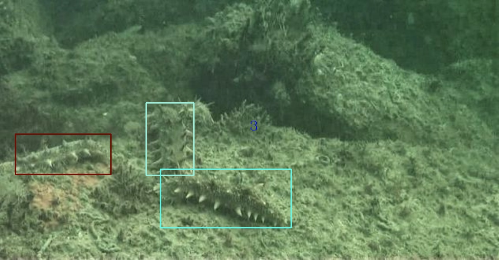
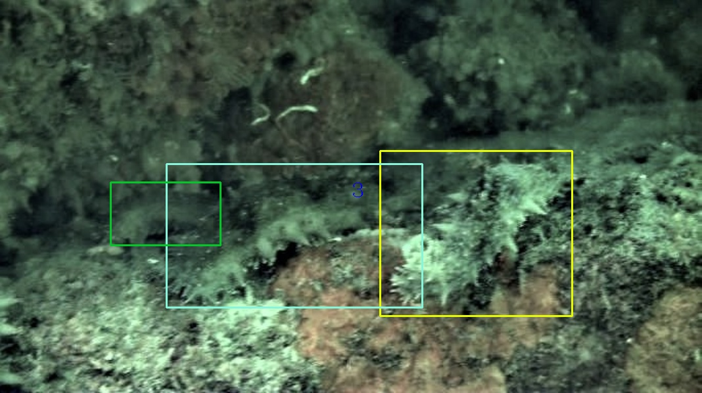
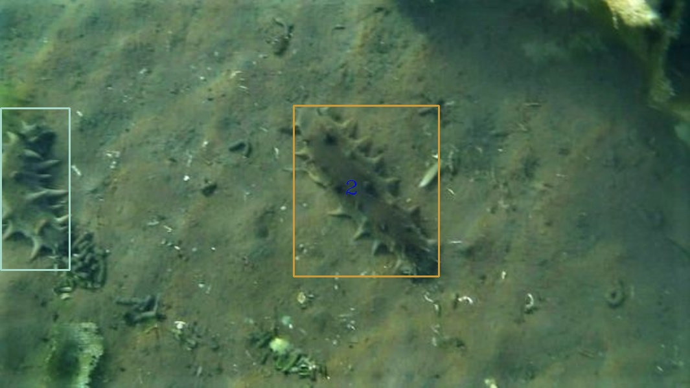

# S-FPN: A shortcut feature pyramid network for sea cucumber detection in underwater images             
        
A Tensorflow implementation of S-FPN detection framework.    
You can refer to the paper [S-FPN: A shortcut feature pyramid network for sea cucumber detection in underwater images](https://www.sciencedirect.com/science/article/abs/pii/S0957417421007351)

If useful to you, please star to support my work. Thanks.    

## Configuration Environment
ubuntu(Encoding problems may occur on windows) + python3 + tensorflow1.2 + cv2 + cuda>=9.0 + GeForce GTX 1080Ti    
## Installation    
  Clone the repository    
  ```Shell    
  git clone https://github.com/FannierPeng/S-FPN_sea-cucumber.git
  ```       

## Make tfrecord   
The data is VOC format, reference [here](01SeaCucumber.xml)     
data path format  ($FPN_ROOT/data/io/divide_data.py)      
```
├── VOCdevkit
│   ├── VOCdevkit_train
│       ├── Annotation
│       ├── JPEGImages
│    ├── VOCdevkit_test
│       ├── Annotation
│       ├── JPEGImages
```     

  ```Shell    
  cd $FPN_ROOT/data/io/  
  python convert_data_to_tfrecord.py --VOC_dir='***/VOCdevkit/VOCdevkit_train/' --save_name='train' --img_format='.jpg' --dataset='sea_cucumber'
  ```

## Demo          
1、Unzip the weight $FPN_ROOT/output/res101_trained_weights/*.rar    
2、put images in $FPN_ROOT/tools/inference_image   
3、Configure parameters in $FPN_ROOT/libs/configs/cfgs.py and modify the project's root directory        
4、image inference           
  ```Shell    
  cd $FPN_ROOT/tools
  python inference.py   
  ```     
  
## Train
1、Modify $FPN_ROOT/libs/lable_name_dict/***_dict.py, corresponding to the number of categories in the configuration file    
2、download pretrain weight([resnet_v1_101.ckpt] or [resnet_v1_50.ckpt]) from [here](https://pan.baidu.com/s/16E-zdpyr-QbGTjMiprZuKw), Fetch Code: 67rc, then extract to folder $FPN_ROOT/data/pretrained_weights    
3、    
  ```Shell    
  cd $FPN_ROOT/tools
  python train.py 
  ``` 

## Test tfrecord     
  ```Shell    
  cd $FPN_ROOT/tools    
  python $FPN_ROOT/tools/test.py  
  ``` 

## eval    
  ```Shell    
  cd $FPN_ROOT/tools   
  python eval.py
  ```  

## Summary   
  ```Shell    
  tensorboard --logdir=$FPN_ROOT/output/res101_summary/
  ```    
  
## Implementation Details
In libs/fast_rcnn/build_fast_rcnn.py, Line 316-324 is the code of piecewise focal loss.
In libs/rpn/build_rpn.py Line 180-403 is the code of shortcut feature pyramid network.


## Test results    
### sea cucumber
   
      
   

## Note 
The method was baesd on FPN reference [FPN_Tensorflow](https://github.com/yangxue0827/FPN_Tensorflow)
    
